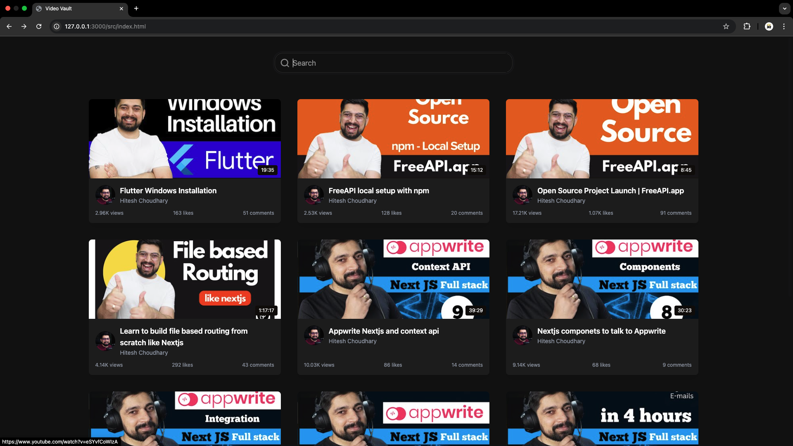
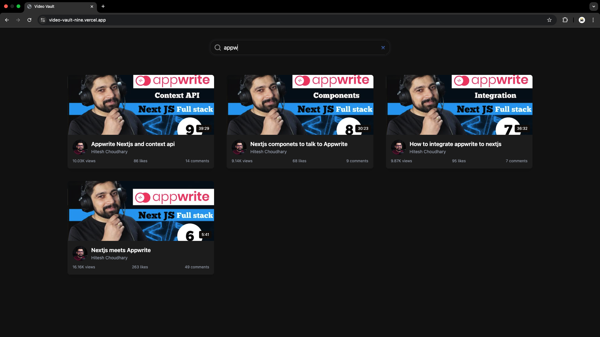

# Video Vault

[](https://video-vault-nine.vercel.app)

## 🎬 Overview

Video Vault is a sleek, modern web application that provides a curated collection of JavaScript tutorial videos from YouTube. With its clean dark-themed interface, users can easily browse, search, and discover high-quality educational content.

## ✨ Features

- **Dark Mode Interface**: Enjoy a visually appealing dark-themed UI that's easy on the eyes during long coding sessions
- **Responsive Design**: Works flawlessly across desktop, tablet, and mobile devices
- **Real-time Search**: Filter videos instantly as you type by title or channel name
- **Video Cards**: Each video is displayed with rich metadata including:
  - High-quality thumbnails
  - Video duration
  - Channel information with avatar
  - View count, like count, and comment statistics
- **Direct YouTube Integration**: One-click access to watch videos on YouTube

## 📸 Screenshots


*Main interface with search functionality and video grid*

## 🚀 Live Demo

Experience Video Vault live: [https://video-vault-app.example.com](https://video-vault-nine.vercel.app)

## 🛠️ Technology Stack

- **Frontend**: HTML5, CSS3, JavaScript
- **Styling**: TailwindCSS
- **API**: YouTube Data API via FreeAPI.app
- **Deployment**: [Your deployment platform]

## 📋 Implementation Details

Video Vault fetches data from the YouTube API through FreeAPI.app, transforming raw video data into a clean, user-friendly interface. The application implements:

- Asynchronous data fetching with error handling
- Dynamic DOM manipulation for rendering video cards
- Real-time search filtering
- Responsive grid layout using CSS Grid
- Human-readable formatting for view counts, likes, and timestamps

## 🚦 Getting Started

1. **Clone the repository**
   ```bash
   git clone https://github.com/yourusername/video-vault.git
   cd video-vault
   ```

2. **Open the project**
   ```bash
   # If you have live-server installed
   live-server
   
   # Or simply open index.html in your browser
   open index.html
   ```

3. **To build CSS (if modifying TailwindCSS)**
   ```bash
   # Install dependencies
   npm install
   
   # Build CSS
   npm run build:css
   ```

## 🔮 Future Enhancements

- User authentication and saved video collections
- Advanced filtering options (by duration, upload date, etc.)
- Dark/light theme toggle
- Custom video player with additional features
- Pagination for browsing larger collections

## 📄 License

This project is licensed under the MIT License - see the LICENSE file for details.

## 🙏 Acknowledgments

- [FreeAPI.app](https://freeapi.app) for providing the YouTube API interface
- [TailwindCSS](https://tailwindcss.com) for the utility-first CSS framework

---